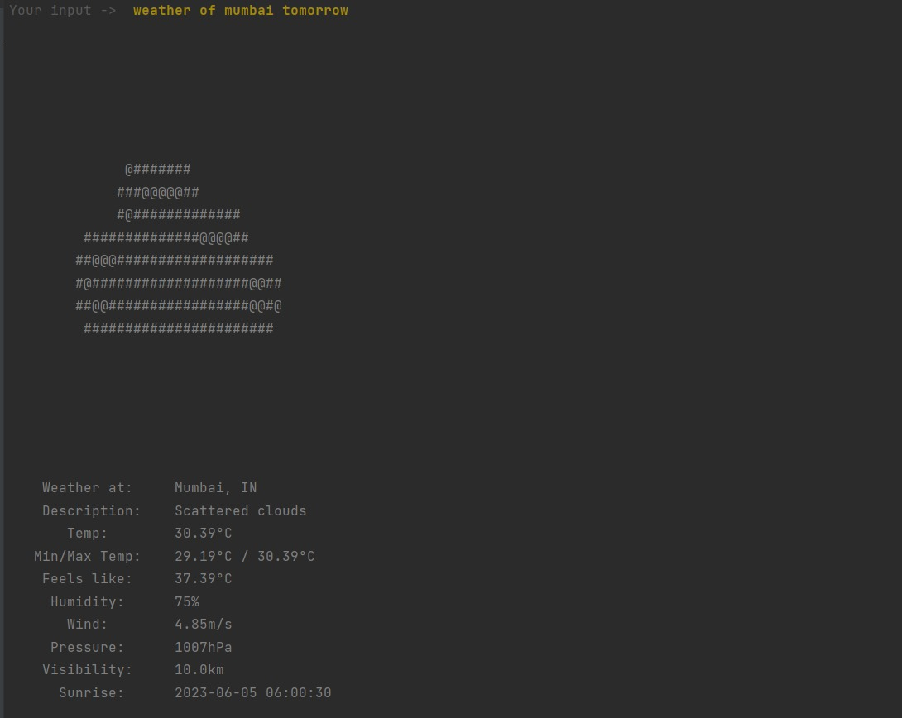

<!-- Improved compatibility of back to top link: See: https://github.com/othneildrew/Best-README-Template/pull/73 -->
<a name="readme-top"></a>
<!--
*** Thanks for checking out the Best-README-Template. If you have a suggestion
*** that would make this better, please fork the repo and create a pull request
*** or simply open an issue with the tag "enhancement".
*** Don't forget to give the project a star!
*** Thanks again! Now go create something AMAZING! :D
-->


<!-- PROJECT SHIELDS -->
<!--
*** I'm using markdown "reference style" links for readability.
*** Reference links are enclosed in brackets [ ] instead of parentheses ( ).
*** See the bottom of this document for the declaration of the reference variables
*** for contributors-url, forks-url, etc. This is an optional, concise syntax you may use.
*** https://www.markdownguide.org/basic-syntax/#reference-style-links
-->
<!-- [![Contributors][contributors-shield]][contributors-url]
[![Forks][forks-shield]][forks-url]
[![Stargazers][stars-shield]][stars-url]
[![Issues][issues-shield]][issues-url]
[![MIT License][license-shield]][license-url]
[![LinkedIn][linkedin-shield]][linkedin-url] -->


<!-- PROJECT LOGO -->
<br />
<div align="center">
  <a href="https://github.com/g-kabra/CliSky">
    
  </a>

<h3 align="center">CliSky</h3>

  <p align="center">
    Introducing CliSky, designed to provide accurate and real-time weather information at your fingertips. This tool utilizes Natural Language Processing (NLP) techniques to understand and process user queries in plain English, allowing you to effortlessly retrieve weather forecasts for any location worldwide. With its user-friendly command-line interface, you can simply input your location or ask questions like 'What's the weather like tomorrow?' or 'Will it rain in London?' The tool fetches up-to-date weather data from the OpenWeatherMap API, offering current conditions, temperature, humidity, wind speed, and more. Stay informed and plan your day effectively with this intuitive NLP-based weather CLI tool.
    <br />
    <br />
    <a href="https://www.youtube.com/watch?v=6NQ6AkoO0WU">View Demo</a>
    ·
    <a href="https://github.com/g-kabra/CliSky/issues">Report Bug</a>
    ·
    <a href="https://github.com/g-kabra/CliSky/issues">Request Feature</a>
  </p>
</div>


<!-- TABLE OF CONTENTS -->
<details>
  <summary>Table of Contents</summary>
  <ol>
    <li>
      <a href="#about-the-project">About The Project</a>
      <ul>
        <li><a href="#built-with">Built With</a></li>
      </ul>
    </li>
    <li>
      <a href="#getting-started">Getting Started</a>
      <ul>
        <li><a href="#prerequisites">Prerequisites</a></li>
        <li><a href="#installation">Installation</a></li>
      </ul>
    </li>
    <li><a href="#usage">Usage</a></li>
    <li><a href="#roadmap">Roadmap</a></li>
    <li><a href="#contributing">Contributing</a></li>
    <li><a href="#license">License</a></li>
    <li><a href="#contact">Contact</a></li>
    <li><a href="#acknowledgments">Acknowledgments</a></li>
  </ol>
</details>


<!-- ABOUT THE PROJECT -->
## About The Project



Introducing CliSky, designed to provide accurate and real-time weather information at your fingertips. This tool utilizes Natural Language Processing (NLP) techniques to understand and process user queries in plain English, allowing you to effortlessly retrieve weather forecasts for any location worldwide. With its user-friendly command-line interface, you can simply input your location or ask questions like 'What's the weather like tomorrow?' or 'Will it rain in London?' The tool fetches up-to-date weather data from the OpenWeatherMap API, offering current conditions, temperature, humidity, wind speed, and more. Stay informed and plan your day effectively with this intuitive NLP-based weather CLI tool.

<p align="right">(<a href="#readme-top">back to top</a>)</p>


### Built With

* [![Python][Python]][Python-url]
* [![TensorFlow][TensorFlow]][TensorFlow-url]
* [![OpenWeatherMap][OpenWeatherMap]][OWM-url]
* [![RASA][RASA]][RASA-url]
<p align="right">(<a href="#readme-top">back to top</a>)</p>


<!-- GETTING STARTED -->
## Getting Started

You can follow the steps below to install the project. Post installation, open up two shells (with the environment activated) to start the tool.

In the first shell, run 
```sh
rasa run actions
```

In the second shell, run
```sh
rasa shell
```

And continue with commands on the second shell in natural language.

### Installation

1. Get a free API Key at [https://openweathermap.org/api](https://openweathermap.org/api)
2. Clone the repo
   ```sh
   git clone https://github.com/g-kabra/CliSky.git
   ```
3. Make a virtual environment
   ```sh
   python -m venv sample_venv
   ```
4. Source the virtual environment
   ```sh
   source sample_venv/bin/activate
   ```
5. Install Python packages
   ```sh
   pip install -r requirements.txt
   ```
6. Enter your OpenWeatherMap API in `.env`
   ```sh
   API_KEY = 'ENTER YOUR API';
   ```

<p align="right">(<a href="#readme-top">back to top</a>)</p>


<!-- USAGE EXAMPLES -->
## Usage

The project can be used for 
1. Quick Weather Updates: Get instant weather updates for any location without the need for complex user interfaces or browsing through multiple websites or apps.

2. Seamless Natural Language Queries: Communicate with the tool using plain English queries, making it easy and intuitive to retrieve weather information without requiring specific commands or syntax.

3. Real-Time Data: Access up-to-date and accurate weather information, ensuring you stay informed about current conditions and any changes in the weather forecast.

4. Efficient Planning: Plan your day effectively by considering weather conditions such as temperature, precipitation, wind speed, and more. This tool enables you to make informed decisions about what to wear, whether to carry an umbrella, or adjust your outdoor plans accordingly.


<p align="right">(<a href="#readme-top">back to top</a>)</p>


<!-- LICENSE -->
## License

Distributed under the MIT License.

<p align="right">(<a href="#readme-top">back to top</a>)</p>


<!-- CONTACT -->
## Contact

Gaurav Kabra - [LinkedIn](https://www.linkedin.com/in/gauravkabra7/) - gauravkab07@gmail.com

Project Link: [https://github.com/g-kabra/CliSky](https://github.com/g-kabra/CliSky)

<p align="right">(<a href="#readme-top">back to top</a>)</p>


<!-- ACKNOWLEDGMENTS -->
## Team Members

* [Karthik S](https://www.linkedin.com/in/karthik-is-dev/)
* [Ananya Gupta](https://www.linkedin.com/in/ananyagupta05/)
* [Vishal](https://www.linkedin.com/in/vishal-499b65239/)

<p align="right">(<a href="#readme-top">back to top</a>)</p>


<!-- MARKDOWN LINKS & IMAGES -->
<!-- https://www.markdownguide.org/basic-syntax/#reference-style-links -->

[Python]: https://img.shields.io/badge/python-3670A0?style=for-the-badge&logo=python&logoColor=ffdd54
[Python-url]: https://nextjs.org/
[RASA]: https://encrypted-tbn0.gstatic.com/images?q=tbn:ANd9GcT5e64MX6EMZh1XRu4jaU0bH1cFwQ7a3Khlc44ghXde&s
[RASA-url]: https://rasa.com/
[OpenWeatherMap]: https://encrypted-tbn0.gstatic.com/images?q=tbn:ANd9GcRaPCJGVn3v8lnjDNqJQLUS-L2VI7aFQcg7XQYUqmwN7g&s
[OWM-url]: https://openweathermap.org/api
[TensorFlow]: https://img.shields.io/badge/TensorFlow-%23FF6F00.svg?style=for-the-badge&logo=TensorFlow&logoColor=white
[TensorFlow-url]: https://www.tensorflow.org/